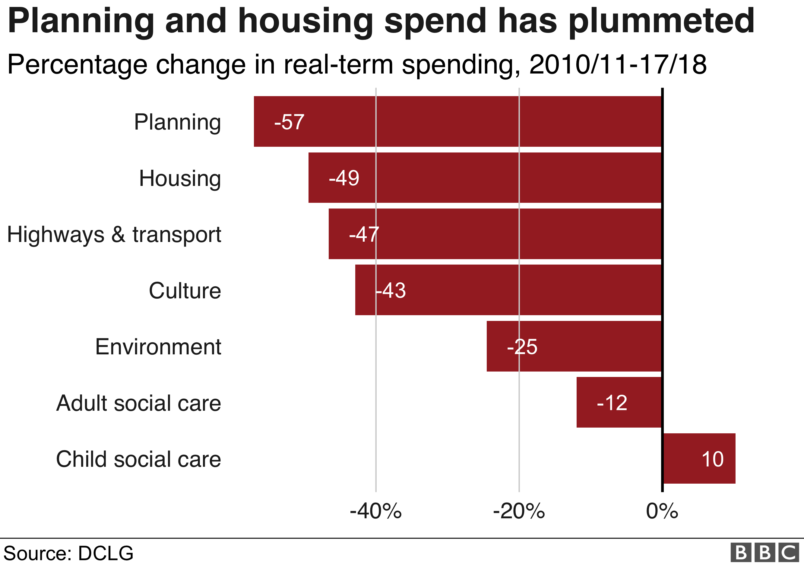

```{r setup, include=FALSE}
knitr::opts_chunk$set(echo = FALSE)
```

# Will my council run out of money?

## 13 councils will run out within 5 years

Out of the 151 councils with social care responsibilities, **13 will run out of emergency reserves in five years** if they continue at their 2017/18 spending rate - about 9%.

**9 councils** will run out of emergency funds within 3 years, while **3 councils** - **Northamptonshire, Buckinghamshire and Herefordshire** - will run out by next year, if they contiue at their present rate of spending:

```{r unallocated run out}
#install.packages("DT")
library(DT)
unallocated.running.out <- read.csv('unallocated.running.out.csv') %>% select(-1) 
DT::datatable(unallocated.running.out, options = list(pageLength = 13, filter = T))
```


## 11 councils have used half of their reserves since 2010

**11 councils** providing social care have cut their financial reserves by half since April 2010.

55 councils reduced their reserves at all since 2010, while the remaining 96 increased their emergency reserves in that time. 


```{r unallocated use up}
reserves.cut <- read.csv('reserves.cut.csv') %>% select(-1) 
DT::datatable(reserves.cut, options = list(pageLength = 11, filter = T))
```


# Real-term spending has plummeted

Spend on housing and planning has taken a huge hit since 2010/11, especially when factoring in inflation.

Out of the key council spending categories, only children's social care spend has risen:




# Council tax

With inflation factored in, there have been widespread reductions in council tax since 2010. 

Out of 325 councils, just **29** had above-inflation increases since 2010. The remaining **296** all saw reductions.

The biggest rises were in **Elmbridge (£114)**, **Surrey Heath (£97)** and **Mole Value (£95)**.

Meanwhile, the biggest falls were all in London, with **Hammersmith & Fulham (-£343)**, **Haringey (£326)** and **Hillingdon (£285)** all boasting inflation-factored falls since 2010/11.

## Other areas to look at

* Why has children's social care spending increased?
* Has spending risen or fallen in Tory/Labour areas?


